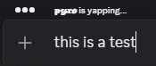
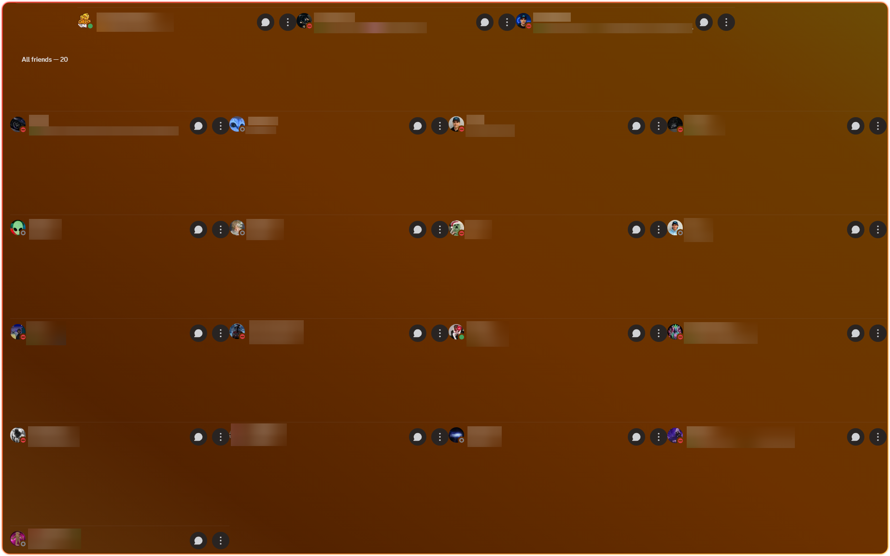
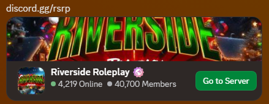
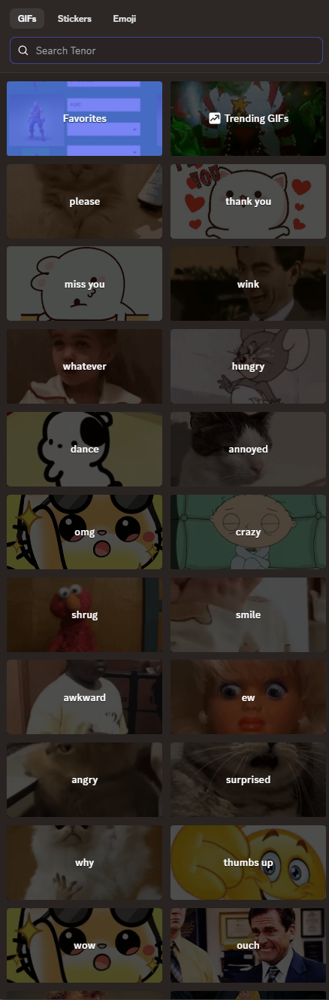
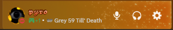

# My Custom CSS Collection

This is a collection of the custom CSS that I use for equicord. This will be updated occasionally.

To use these, The import for each CSS **must be at the very top** of your CSS in Equicord/Vencord, An example is given below.

There are a few that have decent customization and can be done within the root. Examples are provided, Please use them.

---

## Custom User Typing Text

```css
@import url("https://raw.githubusercontent.com/ThatDudePyro/My-Custom-CSS-Collection/refs/heads/main/CustomTypingText.css");

:root {
  /* one user typing */
  --single-user: " is yapping...";
  /*Two to four users typing */
  --multiple-users: " are yapping...";
  /*More than four users typing */
  --several-users: " Several people are yapping...";
  /*name seperator */
  --name-seperator: " and ";
}
```

<div align="center">
  <picture>
    
</div>

---

## Embed Border

```css
@import url("https://raw.githubusercontent.com/ThatDudePyro/My-Custom-CSS-Collection/refs/heads/main/EmbedBorder.css");

:root {
  --wh-border-width: 4px;
  --wh-border-radious: 8px;
  --wh-background-opacity: 25%;
  --wh-default-background: hsl(
    from var(--background-surface-high) h s l / 100%
  );
  --wh-always-show-suppress-embed-button: 0;
}
```

<div align="center">
  <picture>
    
</div>

---

## Example of the two together

```css
@import url("https://raw.githubusercontent.com/ThatDudePyro/My-Custom-CSS-Collection/refs/heads/main/CustomTypingText.css");
@import url("https://raw.githubusercontent.com/ThatDudePyro/My-Custom-CSS-Collection/refs/heads/main/EmbedBorder.css");

/* Custom typing text */
:root {
  /* one user typing */
  --single-user: " is yapping...";
  /*Two to four users typing */
  --multiple-users: " are yapping...";
  /*More than four users typing */
  --several-users: " Several people are yapping...";
}

/* Embed Border */
:root {
  --wh-border-width: 4px;
  --wh-border-radious: 8px;
  --wh-background-opacity: 25%;
  --wh-default-background: hsl(
    from var(--background-surface-high) h s l / 100%
  );
  --wh-always-show-suppress-embed-button: 0;
}
```

---

## Shrinking Growing Friends List

```css
@import url("https://raw.githubusercontent.com/ThatDudePyro/My-Custom-CSS-Collection/refs/heads/main/ShrinkingGrowingFriendsList.css");

:root {
    --friend-row-amount: 2;
}
@media (width < 1300px) {
    #app-mount {
        --friend-row-amount: 2;
    }
}
@media (width < 1100px) {
    #app-mount {
        --friend-row-amount: 2;
    }
}
@media (width < 700px) {
    #app-mount {
        --friend-row-amount: 2;
    }
}
```

<div align="center">
  <picture>
    
</div>

---

## Old Invites

```css
@import url("https://raw.githubusercontent.com/ThatDudePyro/My-Custom-CSS-Collection/refs/heads/main/OldInvites.css");
```

<div align="center">
  <picture>
    
</div>

---


## FullSize Picker

```css
[class*='layerContainer_'] [class*='positionLayer__'] {
    height: 100% !important;
    [class*='drawerSizingWrapper__'] {
        top: 3.5em !important;
        height: calc(100% - 8em)
    }
}
```

<div align="center">
  <picture>
    
</div>

---

## Hide Mute/Deafen menus

```css
div[class^="_37e49614b9f110a9-micButtonParent"] {
  button[role="switch"] {
    border-radius: var(--radius-sm) !important;
    
    ~ button {
      display: none;
    }
  }
}
```

<div align="center">
  <picture>
    
</div>

---

